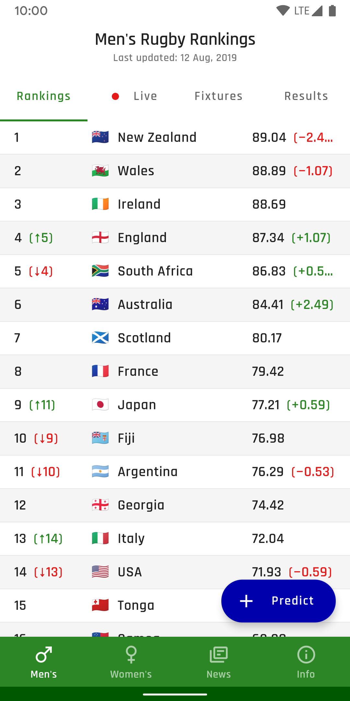
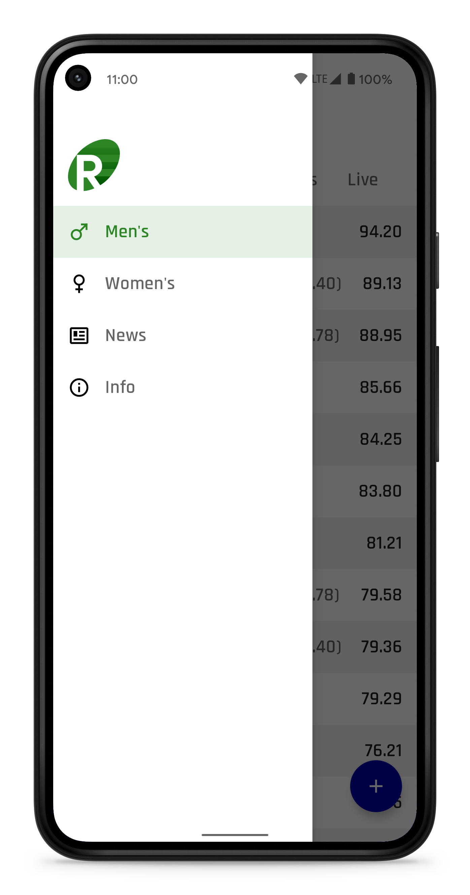
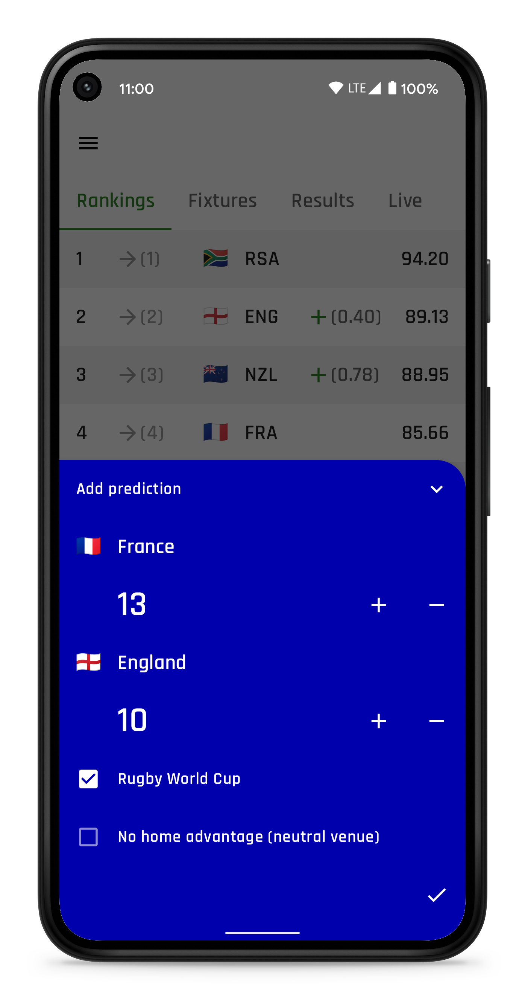
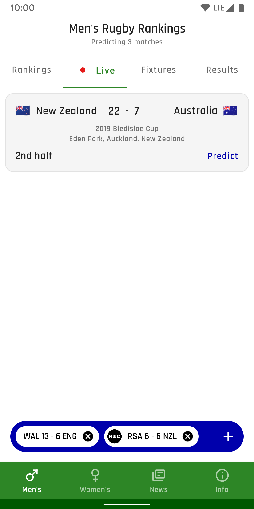
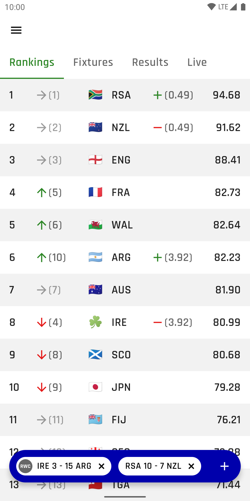
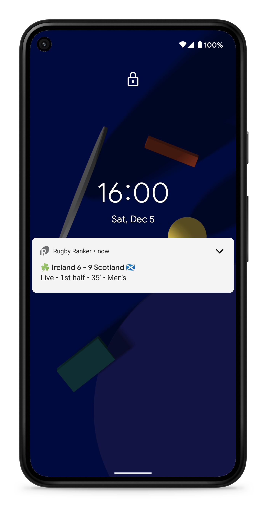
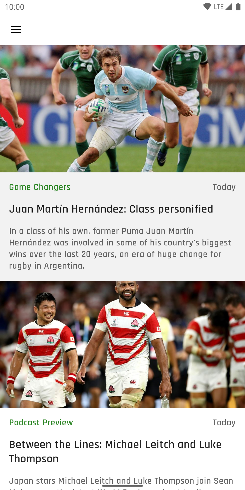

# Rugby Ranker 🏉

[](.github/workflows/workflow.yml)
[](https://ktlint.github.io/)

Rugby Ranker is a **work-in-progress** Android app for viewing and predicting the latest World Rugby rankings.

It displays the latest international rankings, live scores, fixtures, results and news/videos. It makes use of the [World Rugby 'Points Exchange' system](https://www.world.rugby/rankings/explanation) in order to predict changes in team positions and points.

<br>

| Rankings                                      | Drawer                                       | Predict                                          | Predictions                               |
|-----------------------------------------------|----------------------------------------------|--------------------------------------------------|-------------------------------------------|
|  |  |  |  |

| Matches                                       | Live                                         | News                                      | Info                                      |
|-----------------------------------------------|----------------------------------------------|-------------------------------------------|-------------------------------------------|
|  |  |  |  |

<p align="center">
  <a href="https://play.google.com/store/apps/details?id=com.ricknout.rugbyranker" target="_blank">
    
  </a>
</p>

## Android development

Rugby Ranker attempts to make use of the latest Android libraries and best practices:
* Entirely written in [Kotlin](https://kotlinlang.org/) (including [Coroutines](https://kotlinlang.org/docs/reference/coroutines-overview.html) and [Flow](https://kotlinlang.org/docs/reference/coroutines/flow.html)) with [Spotless](https://github.com/diffplug/spotless) for code style
* Makes use of [Android Jetpack](https://developer.android.com/jetpack/):
  * [Architecture Components](https://developer.android.com/jetpack/arch/) including **ViewModel**, **LiveData**, **Room**, **Paging**, **Navigation**, **WorkManager** and **DataStore**
  * [ConstraintLayout](https://developer.android.com/reference/androidx/constraintlayout/widget/ConstraintLayout), [ViewPager2](https://developer.android.com/reference/androidx/viewpager2/widget/ViewPager2), [View Binding](https://developer.android.com/topic/libraries/view-binding) and more for layouts and UI
  * [Emoji2](https://developer.android.com/jetpack/androidx/releases/emoji2) for emoji compatibility on older platforms
  * [Android KTX](https://developer.android.com/kotlin/ktx) for more fluent use of Android APIs
* [Retrofit](https://square.github.io/retrofit/)/[OkHttp](https://square.github.io/okhttp/) for networking
* [Coil](https://coil-kt.github.io/coil/) for image loading
* [Hilt](https://dagger.dev/hilt/) for dependency injection
* Designed and built using Material Design [components](https://material.io/components/) and [theming](https://material.io/design/material-theming/overview.html#material-theming)
* Full [dark theme](https://material.io/design/color/dark-theme.html) support
* Meaningful use of [Material Motion](https://material.io/design/motion/the-motion-system.html) transitions
* Edge-to-edge support using [Insetter](https://github.com/chrisbanes/insetter)
* Slowly migrating to [Jetpack Compose](https://developer.android.com/jetpack/compose)

## Inspiration

Rugby Ranker was inspired by [@rawling](https://github.com/rawling)'s [wr-calc](https://rawling.github.io/wr-calc/) web app, aiming to be a native Android version with a focus on delightful UX/UI design.

## Contributions

Please feel free to file an issue for errors, suggestions or feature requests. Pull requests are also encouraged.

## License

```
Copyright 2023 Nick Rout

Licensed to the Apache Software Foundation (ASF) under one or more contributor
license agreements. See the NOTICE file distributed with this work for
additional information regarding copyright ownership. The ASF licenses this
file to you under the Apache License, Version 2.0 (the "License"); you may not
use this file except in compliance with the License. You may obtain a copy of
the License at

   http://www.apache.org/licenses/LICENSE-2.0

Unless required by applicable law or agreed to in writing, software
distributed under the License is distributed on an "AS IS" BASIS, WITHOUT
WARRANTIES OR CONDITIONS OF ANY KIND, either express or implied. See the
License for the specific language governing permissions and limitations under
the License.
```
